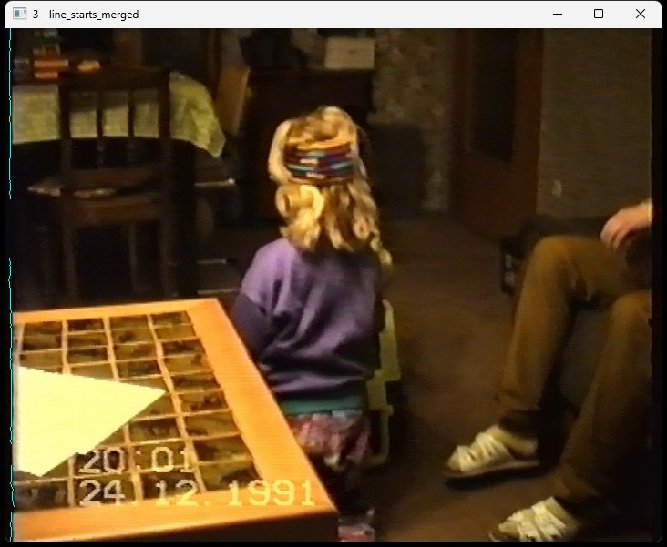
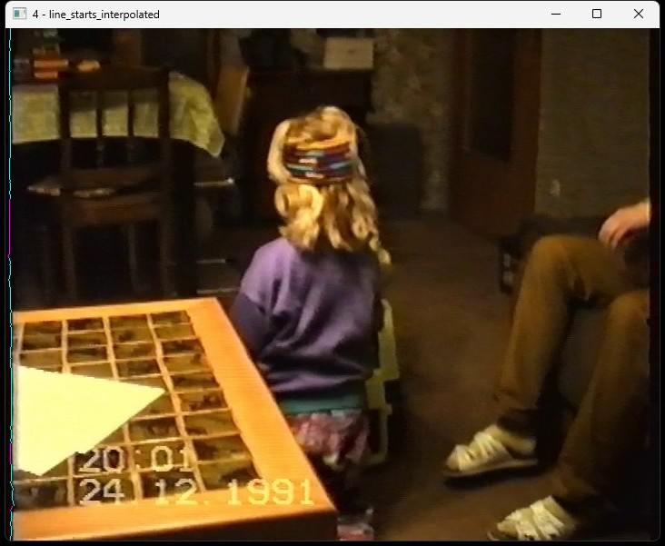

# vhs-deshaker <!-- omit from toc -->

This tool is for fixing a very specific horizontal shaking issue that affects some digitized VHS videos.

## Table of Contents <!-- omit from toc -->

- [Example](#example)
- [How does vhs-deshaker work?](#how-does-vhs-deshaker-work)
- [Install](#install)
- [Usage](#usage)
  - [Pipe video data to ffmpeg directly](#pipe-video-data-to-ffmpeg-directly)
- [Build instructions](#build-instructions)
- [Docker image](#docker-image)
  - [Docker troubleshooting: Input file cannot be opened](#docker-troubleshooting-input-file-cannot-be-opened)
- [See also](#see-also)

## Example

Input example:

https://user-images.githubusercontent.com/1746428/225921679-25f9ba88-bee2-4557-9181-5fd0df6a07b4.mp4

vhs-deshaker output:

https://user-images.githubusercontent.com/1746428/225921734-024c3526-5193-4755-940d-00e3f5f86097.mp4

I do not know what causes this type of horizontal shaking. I first encountered it when digitizing some of our old VHS cassettes with family/childhood videos. Some cassettes were more affected than others, suggesting a mechanical/physical problem.

## How does vhs-deshaker work?

Unfortunately I was unable to fix our videos with traditional video deshaking software. So I decided to try and create my own algorithm for fixing this nasty issue.

My algorithm analyzes the pure black at the left and right borders of VHS video frames. Ideally the pure black area should always have the same width. In my VHS videos,
it should have been 8px on both left and right side of the frames. But due to horizontal shaking and distortions the actual width differed greatly between and within
frames. vhs-deshaker attempts to reverse these deviations by realigning the rows of the video frames such that all frames start at the same column.

To achieve that, vhs-deshaker first applies edge detection to the pure black areas at the left and right borders of VHS videos to determine the horizontal shift for each line:

These shifts, actually described as line_starts (from left side of image) and line_ends (from right side of image), are then denoised. Denoising means that very small consecutive segments of line_starts are removed:

The next step is to merge the information from the line_starts and the line_ends. For rows with both line_start and line_end information, the larger consecutive segment
wins because it is considered more reliable:

There are still many rows for which no line_start data is available. These gaps are filled by linear interpolation (for inner gaps) and extrapolated via nearest-known-value
replication (for outer gaps):

Finally, the line_starts are smoothed. This smoothes any remaining discontinuities in the line_starts and thus ensures that neighboring lines are always shifted
by a very similar amount:

This data is then used to shift/realign all rows of the frame.

## Install

You can download the latest binary from the releases page. The accompanying opencv DLL files must be kept in the same folder as the executable.

It is recommended to also install the ffmpeg binaries on your system and edit your PATH environment variable such that they can be executed from the commandline. (ffmpeg is needed to add back the audio stream to the output files, see below.)

## Usage

In general the command can be executed like this:

    vhs-deshaker <input-file> <output-file> [<framerate>]

The framerate parameter is optional. If omitted, the framerate will be the same as in the input file.

Unfortunately vhs-deshaker can only process video streams. The audio will not be included in the output file. Therefore you have to add back the audio stream manually to the output file. Furthermore, you should know that vhs-shaker uses the lossless HuffYUV video codec to generate the output file. Therefore the output files will be huge and you should make sure your disk has enough free space. Also, the output files must have .avi format / extension because mp4 does not support the HuffYUV codec.

I recommend to use ffmpeg to add back the audio stream to the deshaked video file. For example:

    # Remove horizontal shaking
    vhs-deshaker.exe input.avi deshaked.avi

    # Add back the audio stream and recode the video stream from HuffYUV to H.264
    ffmpeg -vn -i input.avi -an -i deshaked.avi -c:a copy -pix_fmt yuv420p final.mp4

The videos generated by vhs-deshaker are using the HuffYUV codec with full colorspace (YUV 4:4:4). By default ffmpeg would thus generate a H.264 encoded video with
the same YUV 4:4:4 colorspace. I recommend to overwrite this with the ``-pix_fmt yuv420p`` option for better filesize and - most importantly - device compatibility,
since many devices do not support H.264 with YUV 4:4:4.

For details on how to use ffmpeg to mux audio/video streams you can read this StackOverflow post: https://stackoverflow.com/a/12943003/623685

### Pipe video data to ffmpeg directly

Raw video output to stdout can be enabled by specifying `stdout` as output file. You can use this to pipe the raw video data directly to ffmpeg.

Example:

    vhs-deshaker input.avi stdout | ffmpeg -f rawvideo -c:v rawvideo -s 720x564 -pix_fmt bgr24 -r 50 -i pipe: -pix_fmt yuv420p deshaked.mp4

Advantages:

- You do not have to keep around an intermediate video file that is extremely large due to the lossless HuffYUV codec.
- You can deshake and merge the audio stream from the original input file in a single step (not shown in the above example).

Caveats:

- You have to specify the correct video resolution in the call to ffmpeg (e.g. `-s 720x564`).
- You have to specify the framerate in the call to ffmpeg (e.g. `-r 50`).

## Build instructions

See BUILD.md.

## Docker image

You can also run vhs-deshaker via docker. I provide a docker image at [`rsnitsch/vhs-deshaker`](https://hub.docker.com/r/rsnitsch/vhs-deshaker).

Example command:

    docker run -it --rm -v "$(pwd):/videos" --user $(id -u):$(id -g) rsnitsch/vhs-deshaker:latest <input-file> <output-file> [<framerate>]

### Docker troubleshooting: Input file cannot be opened

If the input file cannot be opened, double-check that your input file is actually visible within docker. The option `-v "$(pwd):/videos"`
*should* map the current working directory (on your host system) inside the docker container at `/videos` (which is the working directory
of vhs-deshaker inside the docker container).

You can use the following command to list the files visible inside the vhs-deshaker docker container at `/videos`:

    docker run --entrypoint ls -it --rm -v "$(pwd):/videos" --user $(id -u):$(id -g) rsnitsch/vhs-deshaker:latest -Al

This executes `ls -Al` inside the docker container which lists the files in `/videos`. You should see the same contents as in your
current working directory on your host system. If not, then you have to find out why and fix this first.

## See also

Online threads discussing the issue:

- https://forum.videohelp.com/threads/394670-VHS-Horizontal-Stabilisation
- https://forum.videohelp.com/threads/392186-Way-too-shakey-captured-VHS-video
- https://forum.doom9.org/showthread.php?t=174756
